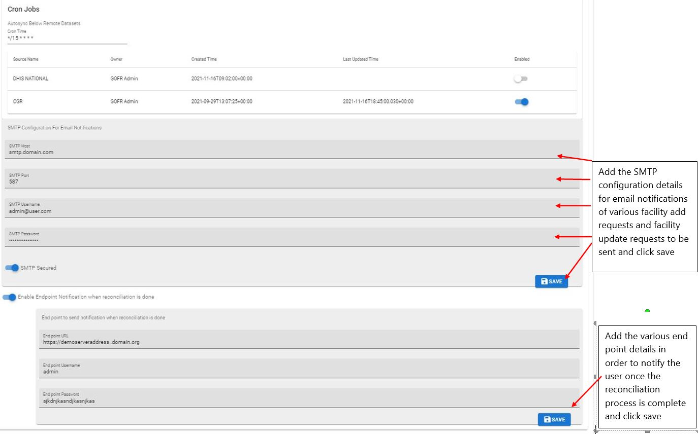

# Configure System

!!! important "Under 'Configure System' the admin/ users of the system are able to set up some constraints for the system"

Under Configure System, we have user configurations as well as admin configurations in gofr.

## User Configuration

**User Defined Headers**

This constraint is used to define which headers should be used, on uploading of a new data source

Once a new data source is uploaded to the system, using a CSV or a remote source, the user can select to use the headers used in the source, or to use the system default headers.

**Active Datasource for Facility Registry**

Users can select the datasource which will be active in the 'Facility Registry' module. By default, this data source is the same as the active data source for the user.

## Admin Configurations

The administrator configurations are done by the system admin of gofr and affect all users in the system.

### Matching configuration

### Dataset configuration

### Email configuration
