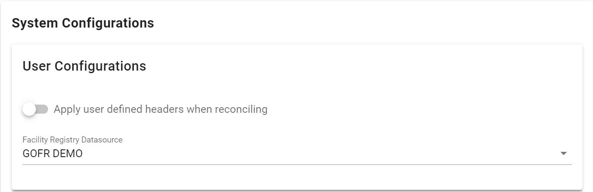
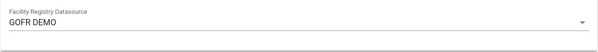

# Configure System

!!! important "Under 'Configure System' the admin/ users of the system are able to set up some constraints for the system"

Under Configure System, we have user configurations as well as admin configurations in gofr.

## User Configuration

**User Defined Headers**

This constraint is used to **define which headers should be used, on uploading of a new data source**

Once a new data source is uploaded to the system, using a CSV or a remote source, the user can **select to use the headers used in the source**, or to use the **system default headers.**

**Active Datasource for Facility Registry**

Users can select the datasource which will be active in the **'Facility Registry'** module. By default, this data source is the **same** as the **active data source** for the user.

To **select -> click** on the **drop- down** and pick the preferred **data source**.

## Admin Configurations

The **administrator configurations** are done by the **system admin** of **GOFR** and affect all users in the system.

### Matching configuration
 
While carrying out the matching process in **Facility Reconciliation,** there's an option to restrict matching to facilities with the same parent.

Once the **Perform match based on parent constraint** option is **activated,** this means, the parent of the facilities must be the same for matching to occur. If deselected, facilities with different parents can also be matched.

If the  **Perform match based on constraint** is activated, the user can choose to:

* **Automatch by ID** - Use the ID to match the facilities
* **Automatch by name** - Use the facility name(s) to match facilities

### Dataset configuration

There are a few options for datasets which should be set up. They include:

**Choose how datasets can be added in the system** 

The admin can restrict the data sources to be used in the system by selecting from the list. To make a source unavailable for use, simple uncheck the respective box from the list provided.

**Allow sharing of datasets to all users by non-admins**

Users without admin permissions can be allowed to share a datasource to 'all users' by selecting this option.

!!! important "Sharing of a datasource by admins is allowed by default."

**Select a datasource to serve as Source 2 for all reconciliation**

 Once this option is selected, reconciliation can only be done against the source which is selected under this option. This restricts users from carrying out reconciliation and matching against other data sources in the system.

**Single data source per user**

Once activated, this restricts users to only one data source.

### GOFR Authentication

Once activated, this 

### Self Registration

There are two options available.Once activated:

* **Enable Self Registration**- Allows new users to register and create their own accounts on gofr
* **Require Admin Approval of Self Registration** - Requires the admin to approve all accounts created on gofr through self registration.

### Public Access

The admin can activate public access and select the partition which will be accessible by the public users of gofr.

### Cron Jobs

GOFR gives users ability to automatically sync data from remote datasets by enabling cron jobs and selecting the time the synchronization takes place.

### Email configuration

SMTP configurations for email notifications are captured here.

