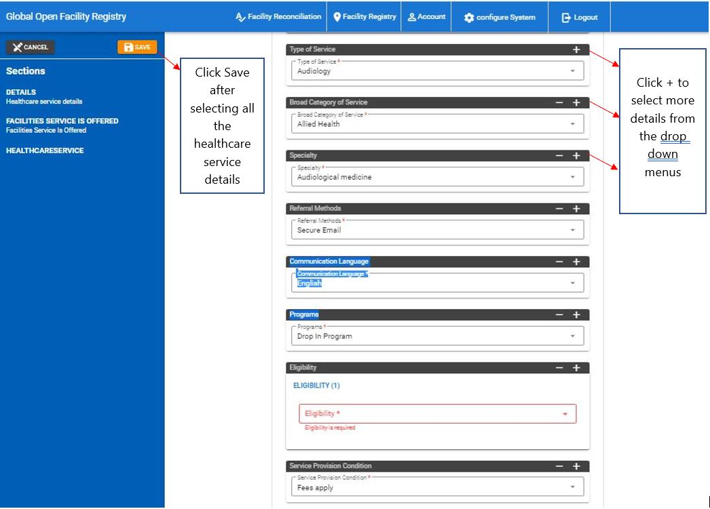
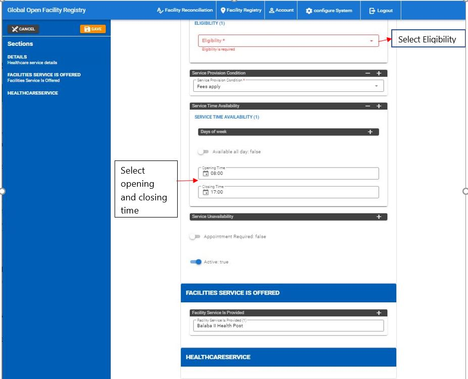

# Facility Registry

!!! important "What is the Facility Registry?"
The **Facility Registry** is **repository** of facilities and healthcare services information in a particular jurisdiction(e.g.country, district etc.)

The Facility Registry Module is a central repository of information on all the facilities in a particular jurisdiction e.g.(country)

The various features on this module include:

- Adding/ Registering new facilities, organizations, services, jurisdictions
- Updating existing facilities, organizations, services, jurisdictions facility details
- Approving requests to add new facility and update facility details

## Jurisdictions

Jurisdictions in gofr refer to geographical locations. Level 1 jurisdictions refer to highest geographical definition e.g. If a country is divided into regions, the regions divided into provinces, and provinces into districts, then in this country, the level 1 jurisdiction is the region, province is level 2 and district is level 3 jurisdiction.

### Add Jurisdiction

### Search Jurisdiction

This feature allows users to search for a jurisdiction by name, type and parent.

## Facility

This feature allows users to add new facilities in the system

### Add Facility

### Search Facility

This feature allows users to view various facilities and search for facilities using the name, type and physical type filters.

## Service

### Add Service

### Search Service

## Organization

### Add Organization

This feature allows users to add an organization to the system.

### Search Organization

## Requests

### Add Request

### Search Facility Update Request

### Search Add Facility Request

